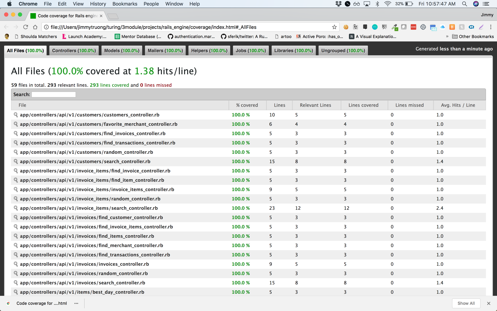

# Rails Engine

A Turing Module 3 project on building a sales engine API using Rails, Active Record, and Postgresql.

## Installing / Getting started

1. ```git clone: git@github.com:jtruong2/rails_engine.git```

1. ```bundle install```

1. ```rake app:import```

1. ```rspec``` to run test suite


## Endpoints

GET /api/v1/merchants/:id/items returns a collection of items associated with that merchant

GET /api/v1/merchants/:id/invoices returns a collection of invoices associated with that merchant from their known orders

GET /api/v1/invoices/:id/transactions returns a collection of associated transactions

GET /api/v1/invoices/:id/invoice_items returns a collection of associated invoice items

GET /api/v1/invoices/:id/items returns a collection of associated items

GET /api/v1/invoices/:id/customer returns the associated customer

GET /api/v1/invoices/:id/merchant returns the associated merchant

GET /api/v1/invoice_items/:id/invoice returns the associated invoice

GET /api/v1/invoice_items/:id/item returns the associated item

GET /api/v1/items/:id/invoice_items returns a collection of associated invoice items

GET /api/v1/items/:id/merchant returns the associated merchant

GET /api/v1/transactions/:id/invoice returns the associated invoice

GET /api/v1/customers/:id/invoices returns a collection of associated invoices

GET /api/v1/customers/:id/transactions returns a collection of associated transactions

GET /api/v1/merchants/most_revenue?quantity=x returns the top x merchants ranked by total revenue

GET /api/v1/merchants/most_items?quantity=x returns the top x merchants ranked by total number of items sold

GET /api/v1/merchants/revenue?date=x returns the total revenue for date x across all merchants

GET /api/v1/merchants/:id/revenue returns the total revenue for that merchant across successful transactions

GET /api/v1/merchants/:id/revenue?date=x returns the total revenue for that merchant for a specific invoice date x

GET /api/v1/merchants/:id/favorite_customer returns the customer who has conducted the most total number of successful transactions.

GET /api/v1/merchants/:id/customers_with_pending_invoices returns a collection of customers which have pending (unpaid) invoices.

GET /api/v1/items/most_revenue?quantity=x returns the top x items ranked by total revenue generated

GET /api/v1/items/most_items?quantity=x returns the top x item instances ranked by total number sold

GET /api/v1/items/:id/best_day returns the date with the most sales for the given item using the invoice date.

GET /api/v1/customers/:id/favorite_merchant returns a merchant where the customer has conducted the most successful transactions


## Features

This project uses RSpec to do request testing

SimpleCov used to show test coverage



## Credit

Project Spec was designed by Turing School Software and Design

Project was completed by student, Jimmy Truong
